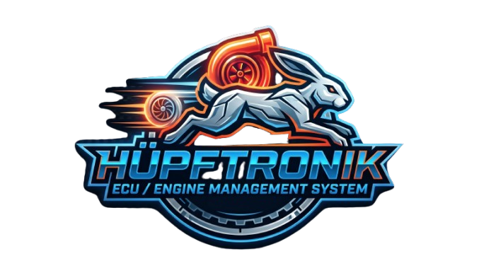

# Welcome

This documentation covers the Hüpftronik ECU ecosystem.

On this site, you can find product overviews, hardware setup and wiring guides, flashing instructions, tuning basics, and troubleshooting tips for our ECU systems.

---

## 1. What you can find here

- Product introductions for the Motorsteurgerät and Schildknappe systems
- Wiring and mounting guidance for DIY car and motorcycle builds
- Flashing and configuration instructions for supported ECUs
- Tuning fundamentals and troubleshooting advice
- Reference material for connectors, sensors, and common setups

---

## 2. Start here

- [Motorsteurgerät overview and wiring](products/motorsteuergerat/)
- [Tuning basics](tuning/basics.md)
- [Troubleshooting tips](tuning/troubleshooting.md)

---

## 3. Hüpftronik

Hüpftronik is a collection of hardware solutions and documentation specifically for people building their own custom car and motorcycle projects.

### 3.1. Motorsteurgerät

The Motorsteurgerät (Engine Control Unit) is the first product in the Hüpftronik world. 

Compared to its early days around the year 2000, the market for standalone ECUs and related solutions has grown massively. Today, there is a wide variety of professional, open-source, and DIY products available, each with its own set of pros and cons. However, none of them suited our requirements.

So this meant we had to develop it ourselves.

Furthermore, we thought it would be cool to have an in-house designed ECU that we could confidently use in our own clients' builds without being dependent on third-party manufacturers. Because we engineered the hardware ourselves, the platform is easier to modify and expand, and we can fully leverage our intimate knowledge of the system.    

