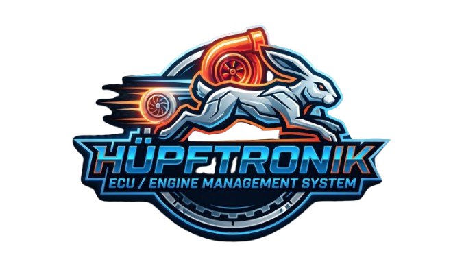

# Welcome

This documentation covers the Hüpftronik ECU ecosystem.

On this site, you can find product overviews, hardware setup and wiring guides, flashing instructions, tuning basics, and troubleshooting tips for our ECU systems.

---

## 1. What you can find here

- Product introductions for the Motorsteuergerät and the upcoming [Schildknappe](products/schildknappe/index.md) (in development)
- Wiring and mounting guidance for DIY car and motorcycle builds
- Flashing and configuration instructions for supported ECUs
- Tuning fundamentals and troubleshooting advice
- Reference material for connectors, sensors, and common setups

---

## 2. Start here

- [Motorsteuergerät 24P V1 overview](products/motorsteuergerat-24p-v1/24p_v1_overview.md) — what the board is and what it can drive
- [Setup and Commissioning](products/motorsteuergerat-24p-v1/setup/index.md) — the step-by-step path from planning your build to first start
- [Tuning basics](guides/tuning/basics.md) — once the engine runs
- [Troubleshooting](guides/setup/troubleshooting.md) — when something doesn't work as described

---

## 3. Hüpftronik

Hüpftronik is a collection of hardware solutions and documentation specifically for people building their own custom car and motorcycle projects.

### 3.1. Motorsteuergerät

The Motorsteuergerät (Engine Control Unit) is the first Hüpftronik product.

The standalone-ECU market has grown massively since its early days around the year 2000, and there
is no shortage of professional, open-source, and DIY products to choose from. What we wanted,
though — an affordable, fully open ECU we could confidently use in our own clients' builds without
depending on third-party manufacturers — didn't exist. So we designed it ourselves.

Because we engineered the hardware in-house, the platform is easy to modify and expand, and we know
every corner of it. That knowledge flows directly back into these pages.

