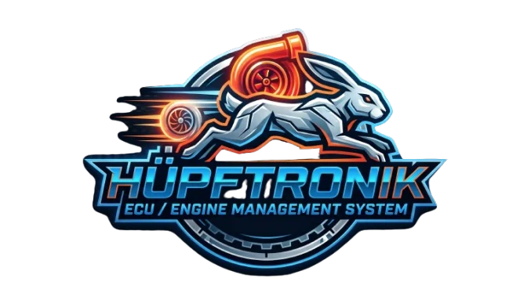
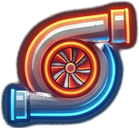
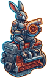
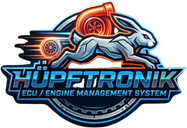

# Welcome

This documentation covers the Hüpftronik ECU ecosystem.

On this site, you can find product overviews, hardware setup and wiring guides, flashing instructions, tuning basics, and troubleshooting tips for our ECU systems.

---

## 1. Start here

-   { .card-icon }

    **Motorsteuergerät 24P V1**

    ---

    What the board is, its specifications, and the full connector pinout.

    [Product overview →](products/motorsteuergerat-24p-v1/24p_v1_overview.md)

-   { .card-icon }

    **Getting Started**

    ---

    The numbered path from planning your build to the first engine start.

    [Setup and Commissioning →](products/motorsteuergerat-24p-v1/setup/index.md)

-   { .card-icon }

    **Tuning**

    ---

    Fuel and ignition tables, base maps, and working in TunerStudio.

    [Tuning Basics →](guides/tuning/basics.md)

-   { .card-icon }

    **Vehicle Guides**

    ---

    Engine-specific triggers, sensors, and settings — starting with the Volvo redblock.

    [Vehicle-specific guides →](guides/setup/specific/index.md)

-   { .card-icon }

    **Tools**

    ---

    Harness Bench for drawing your wiring, and the B230 compression calculator.

    [Browser tools →](tools/index.md)

-   { .card-icon }

    **About Hüpftronik**

    ---

    Our design philosophy, how we use AI, and how to report a problem.

    [Our Philosophy →](about/philosophy.md)

Stuck? See [Troubleshooting](guides/setup/troubleshooting.md). A second product, the
[Schildknappe](products/schildknappe/index.md) CAN expansion node, is in development.

---

## 2. Hüpftronik

Hüpftronik is a collection of hardware solutions and documentation specifically for people building their own custom car and motorcycle projects.

### 2.1. Motorsteuergerät

The Motorsteuergerät (Engine Control Unit) is the first Hüpftronik product.

The standalone-ECU market has grown massively since its early days around the year 2000, and there
is no shortage of professional, open-source, and DIY products to choose from. What we wanted,
though — an affordable, fully open ECU we could confidently use in our own clients' builds without
depending on third-party manufacturers — didn't exist. So we designed it ourselves.

Because we engineered the hardware in-house, the platform is easy to modify and expand, and we know
every corner of it. That knowledge flows directly back into these pages.

