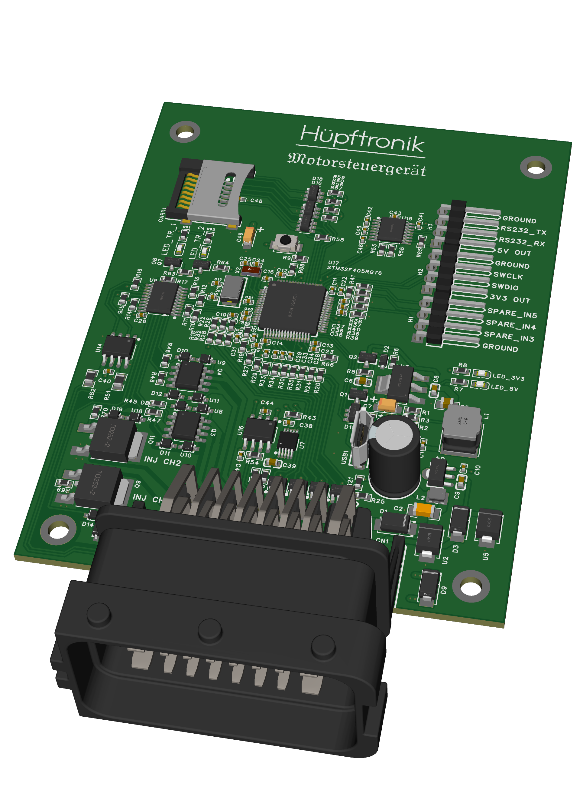

# Motorsteuergerät 24P V1

<alt="Tooltip">Current status : Alpha testing

---

## 1. Overview

The Motorsteuergerät 24P V1 is Hüpftronik's main engine control unit — an open-hardware ECU built
around the STM32F405 microcontroller and running a rusEFI firmware image built from the rusEFI firmware project. It handles fuel injection, ignition
timing, and auxiliary outputs through a single sealed 24-pin connector.

---

## 2. Specifications

| Parameter | Value |
|---|---|
| MCU | STM32F405RGT6 — 168 MHz Cortex-M4F |
| Flash | 1 MB |
| RAM | 192 KB |
| Firmware project | rusEFI (open-source, GPLv3) |
| Connector | FCI 24-pin sealed automotive (3×8 grid) |
| Power input | 12 V automotive nominal — KL30 (permanent) + KL15 (switched) |
| SD card logging | Native SDIO — supports Class 10 cards |
| CAN bus | 1× ISO 11898 channel |
| USB | Full-speed — console access and firmware flashing |

---

## 3. IO Overview

All 24 pins are on a single FCI connector, arranged in three rows (A, B, C) of eight columns.

**Power and reference**

| Pin | Signal | Description |
|---|---|---|
| A1 | VIN_KL15 | Ignition-switched +12 V input |
| B1 | VIN_KL30 | Permanent battery +12 V input |
| C5 | +5V | Sensor reference voltage output |
| B8, C1 | GND | Power ground (×2) |

**Engine position**

| Pin | Signal | Description |
|---|---|---|
| C4 | VR_POS | Crank / cam VR sensor (+) |
| B4 | VR_NEG | Crank / cam VR sensor (−) |

**Analog sensor inputs**

| Pin | Signal | Description |
|---|---|---|
| A2 | LAMBDA_RAW | Wideband / narrowband O₂ |
| A3 | IAT_RAW | Intake air temperature |
| A4 | CLT_RAW | Coolant temperature |
| B3 | MAP_RAW | Manifold absolute pressure |
| C3 | TPS_RAW | Throttle position |
| C2 | SPARE_IN1 | General-purpose analog / digital input |
| B2 | SPARE_IN2 | General-purpose analog / digital input |

**Low-side driver outputs**

| Pin | Signal | Description |
|---|---|---|
| C8 | INJ1_DRV | Injector channel 1 |
| A8 | INJ2_DRV | Injector channel 2 |
| A6 | BOOST_DRV | Boost control solenoid |
| A7 | IAC_DRV | Idle air control valve |
| B6 | FPRELAY_DRV | Fuel pump relay trigger |
| B7 | FANRELAY_DRV | Radiator fan relay trigger |

**Ignition outputs**

| Pin | Signal | Description |
|---|---|---|
| C7 | IGN1_OUT | Ignition driver channel 1 |
| C6 | IGN2_OUT | Ignition driver channel 2 |

**Communications**

| Pin | Signal | Description |
|---|---|---|
| A5 | CAN_H | CAN bus high |
| B5 | CAN_L | CAN bus low |

---

## 4. Expansion headers

The PCB includes three simple 4-pin headers for board-level expansion and service access.

| Header | Pin | Signal | Description |
|---|---|---|---|
| H1 | 1 | SPARE_IN5_RAW | Spare digital input 5 |
|  | 2 | SPARE_IN4_RAW | Spare digital input 4 |
|  | 3 | SPARE_IN3_RAW | Spare digital input 3 |
|  | 4 | GND | Ground reference |
| H2 | 1 | +3V3 | 3.3 V power for SWD adapter |
|  | 2 | SWDIO | SWD data line |
|  | 3 | SWCLK | SWD clock line |
|  | 4 | GND | Ground reference |
| H3 | 1 | +5V | 5 V power output |
|  | 2 | RS232_RX | RS232 receive input |
|  | 3 | RS232_TX | RS232 transmit output |
|  | 4 | GND | Ground reference |

These headers make it easy to attach external debugging, logging or custom input wiring without modifying the main 24-pin automotive connector.

