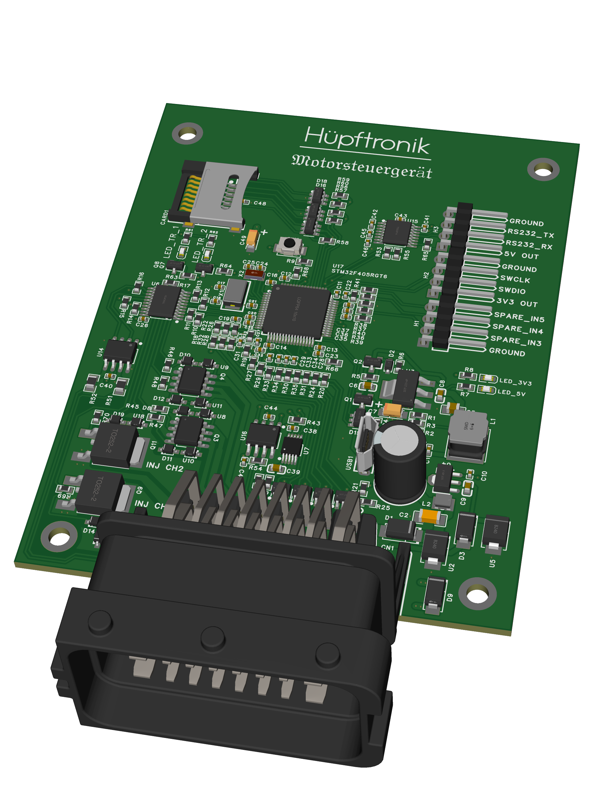
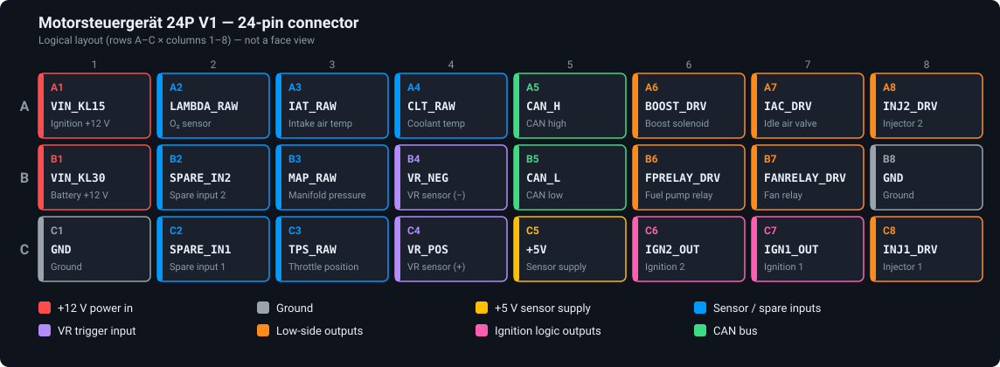
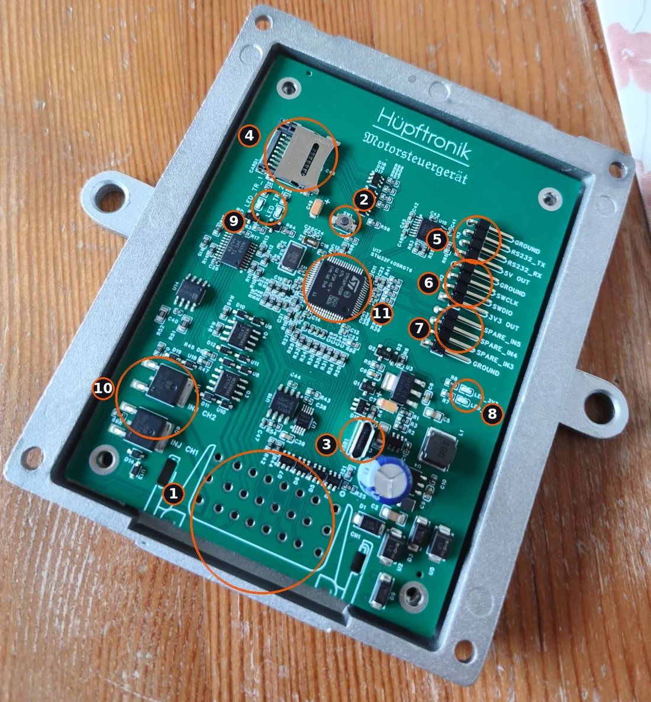

# Motorsteuergerät 24P V1

Current status: Alpha testing

--8<-- "status-reviewed.md"

---

## 1. Overview

The Motorsteuergerät 24P V1 is Hüpftronik's main engine control unit — an open-hardware ECU built
around the STM32F405 microcontroller, running open-source firmware you compile yourself. Both
**rusEFI** and **Speeduino** are supported (see
[Setup and Commissioning](setup/index.md#3-firmware-architecture-choosing-your-path) for choosing
between them). It handles fuel injection, ignition
timing, and auxiliary outputs through a single sealed 24-pin connector.

---

## 2. Specifications

| Parameter | Value |
|---|---|
| MCU | STM32F405RGT6 — 168 MHz Cortex-M4F |
| Flash | 1 MB |
| RAM | 192 KB |
| Firmware project | rusEFI or Speeduino (open-source, GPLv3) |
| Connector | FCI 24-pin sealed automotive (3×8 grid) |
| Power input | 12 V automotive nominal — KL30 (permanent) + KL15 (switched) |
| SD card logging | Native SDIO — supports Class 10 cards |
| CAN bus | 1× ISO 11898 channel |
| USB | Full-speed, USB-C connector (`USB1`) — console access and firmware flashing |
| Status LEDs | Four, labeled `LED_3V3`, `LED_5V`, `LED_TR_1`, and `LED_TR_2` (see [§5](#5-board-layout)). What each one indicates is *to be confirmed* |

**Mechanical and environmental**

| Parameter | Value |
|---|---|
| Board dimensions | *To be confirmed* — designed to fit the standard 24-pin cast aluminum ECU enclosure (see [Hardware Reference §1](reference.md#1-enclosure-options)) |
| Mounting | Via the matching aluminum enclosure; PCB thermally coupled to the case floor with a TIM pad (see [Hardware Reference §2](reference.md#2-keeping-it-cool-thermal-management)) |
| Mating connector | FCI 24-pin sealed automotive housing, 3×8 grid — supplied with the recommended enclosure; terminals crimp with an SN-48B (see [Wiring guide §2](wiring.md#2-connectors)) |
| Operating temperature | *To be confirmed* — component selection targets automotive engine-bay ambient |
| Quiescent current draw | *To be confirmed* |

!!! note "Values marked *to be confirmed*"
    The board is in alpha testing; dimensions, temperature rating, and current draw will be filled
    in from measurements on production-candidate hardware.

---

## 3. IO Overview

All 24 pins are on a single FCI connector, arranged in three rows (A, B, C) of eight columns.

*Logical pin layout, color-coded by function. This is not a face view: which way the grid appears
when you look at the connector (wire side or mating side) is* to be confirmed *— check the pin
numbers moulded into the housing before you crimp. The tables below list the same pins with
descriptions.*

!!! success "Reverse polarity and surge protection"
    `VIN_KL30` and `VIN_KL15` are protected +12 V inputs. A series Schottky diode blocks reversed
    polarity, and a TVS crowbar behind it clips short voltage surges before they reach the voltage
    regulators.

!!! warning "Long term overvoltage"
    Sustained overvoltage above 20 V on these power pins overheats the TVS diode until it fails
    short.

**Power and reference**

| Pin | Signal | Description |
|---|---|---|
| A1 | VIN_KL15 | Ignition-switched +12 V input |
| B1 | VIN_KL30 | Permanent battery +12 V input |
| C5 | +5V | Sensor reference voltage output |
| B8, C1 | GND | Ground (×2) — the only ground pins; sensor grounds also return here |

There is no separate sensor-ground pin. Sensor ground wires return to the ECU's `GND` pins
(B8/C1) through the harness, on their own wire, never shared with a load return — see
[Wiring guide §1.1](wiring.md#11-grounding-topology).

**Engine position**

The board has a differential VR sensor input `VR_POS`/`VR_NEG` using a dedicated MAX9924 IC.

| Pin | Signal | Description |
|---|---|---|
| C4 | VR_POS | Crank / cam VR sensor (+) |
| B4 | VR_NEG | Crank / cam VR sensor (−) |

**Analog sensor inputs**

| Pin | Signal | Description |
|---|---|---|
| A2 | LAMBDA_RAW | Wideband / narrowband O₂ |
| A3 | IAT_RAW | Intake air temperature |
| A4 | CLT_RAW | Coolant temperature |
| B3 | MAP_RAW | Manifold absolute pressure |
| C3 | TPS_RAW | Throttle position |
| C2 | SPARE_IN1 | General-purpose analog / digital input (e.g. Hall cam-sync sensor) |
| B2 | SPARE_IN2 | General-purpose analog / digital input (e.g. Hall cam-sync sensor) |

**Low-side driver outputs**

| Pin | Signal | Description |
|---|---|---|
| C8 | INJ1_DRV | Injector channel 1 |
| A8 | INJ2_DRV | Injector channel 2 |
| A6 | BOOST_DRV | Boost control solenoid |
| A7 | IAC_DRV | Idle air control valve |
| B6 | FPRELAY_DRV | Fuel pump relay trigger |
| B7 | FANRELAY_DRV | Radiator fan relay trigger |

**Ignition outputs**

| Pin | Signal | Description |
|---|---|---|
| C7 | IGN1_OUT | Ignition driver channel 1 |
| C6 | IGN2_OUT | Ignition driver channel 2 |

**Communications**

| Pin | Signal | Description |
|---|---|---|
| A5 | CAN_H | CAN bus high |
| B5 | CAN_L | CAN bus low |

---

## 4. Expansion headers

The PCB includes three simple 4-pin headers for board-level expansion and service access.

| Header | Pin | Signal | Description |
|---|---|---|---|
| H1 | 1 | GND | Ground reference |
|  | 2 | SPARE_IN3_RAW | Spare digital-only input 3 |
|  | 3 | SPARE_IN4_RAW | Spare digital-only input 4 |
|  | 4 | SPARE_IN5_RAW | Spare digital-only input 5 |
| H2 | 1 | +3V3 | 3.3 V power for SWD adapter |
|  | 2 | SWDIO | SWD data line |
|  | 3 | SWCLK | SWD clock line |
|  | 4 | GND | Ground reference |
| H3 | 1 | +5V | 5 V power output |
|  | 2 | RS232_RX | RS232 receive input |
|  | 3 | RS232_TX | RS232 transmit output |
|  | 4 | GND | Ground reference |

These headers make it easy to attach external debugging, logging or custom input wiring without modifying the main 24-pin automotive connector.

On the board, H3, H2, and H1 sit in one row of twelve 2.54 mm pins (see [§5](#5-board-layout)). Pin 1
of each header is the square pad, and every pin is labeled on the silkscreen — check those labels
before you connect anything.

`SPARE_IN3`–`SPARE_IN5` on H1 accept 0–5 V **digital** signals only. Unlike `SPARE_IN1`/`SPARE_IN2`
on the main connector, they cannot be used as analog inputs. To wire them up, you supply the mating
2.54 mm connector.

!!! warning "H1 spare inputs have no dedicated ESD protection"
    Unlike the main connector's analog inputs (protected by a TVS diode — see the
    [Hardware Reference](reference.md#3-sensor-inputs-analog-inputs)), `SPARE_IN3`–`SPARE_IN5` on H1
    are protected only by their input resistor divider. Keep wiring to these pins short and route it
    away from ignition and high-current leads.

---

## 5. Board layout

*Motorsteuergerät 24P V1 in its enclosure, main connector at the bottom. Numbers match the table
below.*

| # | Part | Silkscreen | Notes |
|---|---|---|---|
| 1 | Main 24-pin connector | `CN1` | Pinout in [§3](#3-io-overview). Shown here without the connector fitted. |
| 2 | Push-button | `SW1` | The only push-button on the board — the boot switch used for [DFU flashing](setup/flashing.md#2-usb-dfu-bootloader). Its BOOT0 function is *to be confirmed* against the schematic. |
| 3 | USB-C port | `USB1` | TunerStudio connection and DFU flashing. |
| 4 | microSD card slot | `CARD1` | SD logging — see [Hardware Reference §8.2](reference.md#82-sd-card-logging). |
| 5 | Header H3 — RS232 | `H3` | `GROUND`, `RS232_TX`, `RS232_RX`, `5V OUT` — see [§4](#4-expansion-headers). |
| 6 | Header H2 — SWD | `H2` | `GROUND`, `SWCLK`, `SWDIO`, `3V3 OUT` — for an ST-Link programmer. |
| 7 | Header H1 — spare inputs | `H1` | `SPARE_IN5`, `SPARE_IN4`, `SPARE_IN3`, `GROUND`. |
| 8 | Supply LEDs | `LED_3V3`, `LED_5V` | Function *to be confirmed*. |
| 9 | Status LEDs | `LED_TR_1`, `LED_TR_2` | Function *to be confirmed*. |
| 10 | Injector driver MOSFETs | `INJ CH1`, `INJ CH2` | `IRLR2905` drivers for `INJ1_DRV`/`INJ2_DRV` — see [Hardware Reference §4](reference.md#4-outputs-low-side-drivers). |
| 11 | Microcontroller | `U17` | `STM32F405RGT6`. |

---

## 6. Next steps

To build with this board, start at [Setup and Commissioning](setup/index.md) — the roadmap for
the numbered **Getting Started** pages. For circuit-level detail behind the specifications above,
see the [Hardware Reference](reference.md).
