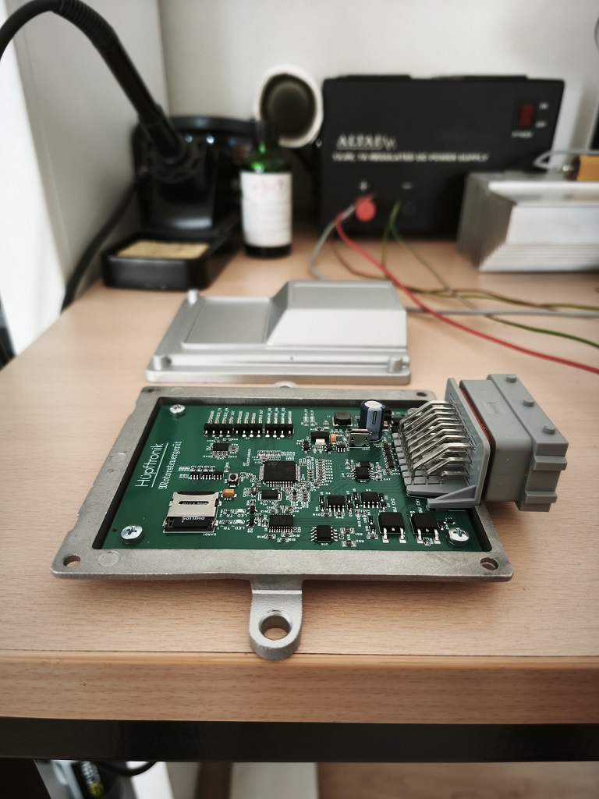
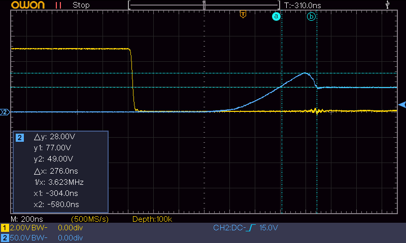

# Hardware Reference
--8<-- "status-reviewed.md"

This guide provides a walkthrough of the schematics and PCB designs for the Hüpftronik Engine Control Unit (ECU). 

!!! note "Design files"
    The board is currently in alpha testing (see the [product overview](24p_v1_overview.md)) and the
    schematic/PCB source files are not yet published. This page will link to the GitHub repository
    once the design is public.

This document covers how the ECU is built, how it stays cool, and how the electrical circuits handle signals and power.

---

## 1. Enclosure Options

Choosing the right case is important for protecting the electronics and keeping the unit from overheating.

### 1.1. Quick Selection Guide
| Case Choice | Cooling Performance | Effort to Build | Best For... |
| :--- | :--- | :--- | :--- |
| **AliExpress 24-Pin Aluminum** | **Excellent** | **Low** (Plug-and-play) | Standard builds, high-performance engines, and harsh environments. |
| **Custom / 3D-Printed** | **Poor** | **High** (Requires custom design) | Test benches or very tight spaces. |

### 1.2. Recommended: AliExpress 24-Pin Aluminum Enclosure
The PCB is designed specifically to fit the standard 24-pin cast aluminum waterproof enclosure. The connector on the board matches the one provided with these cases perfectly.

Using this aluminum case provides two major benefits:
* **Heat Sinking:** The metal case pulls heat away from the components, preventing them from burning out.
* **Electrical Shielding:** The metal shell acts as a shield, stopping electrical noise from the engine from interfering with the ECU's "brain."

!!! tip "Sourcing"
    Search AliExpress or a similar marketplace for "24 pin waterproof aluminum ECU case" — several
    sellers offer this connector/enclosure combination. We don't yet have a vetted single source to
    link to directly; verify the connector pinout matches an FCI 24-pin sealed automotive connector
    (3×8 grid) before buying.

### 1.3. Custom / DIY Solutions
If you prefer your own housing, you can do so, but you must handle two things carefully:

1. **The Connector:** You will need to source the 24-pin automotive header separately, as it is not a standard part.

2. **The Heat:** Plastic (3D printed) cases trap heat. If you use plastic, you **must** design a flat aluminum base plate and use a thermal pad to connect the PCB to that metal plate.

---

## 2. Keeping it Cool (Thermal Management)

The "injector drivers" (the parts that fire your fuel injectors) generate heat. If they get too hot, they will fail.

If you use the aluminum enclosure, you can significantly improve cooling by placing a **Thermal Interface Material (TIM) pad** (a squishy, non-conductive heat pad) between the bottom of the PCB and the inside floor of the case.

| Setup | Heat Level | Cooling Requirement |
| :--- | :--- | :--- |
| **2 Cylinders per Driver** (Standard) | Low | Standard PCB cooling is usually enough. A thermal pad is a good "extra" safety measure. |
| **4 Cylinders per Driver** (High Stress) | High | **Mandatory:** You must use a thermal pad to bridge the heat directly to the aluminum case. |

*(For the math behind these requirements, see **§A.1 Thermal Analysis** in the Technical Appendix)*

---

## 3. Sensor Inputs (Analog Inputs)

Analog inputs are used to read sensors (like temperature or pressure). Because engine bays are "electrically noisy," the signals are cleaned up before they reach the processor.

### 3.1. Quick Specs
* **Input Voltage:** Accepts 0–5 V (scales it down to 0–3.24 V for the processor).
* **Filtering:** Removes high-frequency electrical noise.
* **Protection:** Includes a "TVS diode" to protect against static electricity (ESD).

### 3.2. How it Works
1. **Protection:** As soon as the signal enters the board, a diode blocks static shocks from hitting the processor.
2. **Cleaning:** A small network of resistors and a capacitor (an RC filter) smooths out the signal.
3. **Scaling:** The processor can only handle up to 3.3 V. The circuit scales the standard 5 V sensor signal down so it fits safely.

*(For a detailed circuit breakdown, see **§A.3 Analog Input Topology** in the Technical Appendix)*

---

## 4. Outputs (Low-Side Drivers)

The ECU uses "Low-Side Drivers" to act as electronic switches for relays, solenoids, and injectors.

### 4.1. Why use discrete MOSFETs?
You might see "Smart Drivers" in other ECUs. We use discrete MOSFETs because they are cheaper, can handle more current, and switch faster. Since we know exactly what we are powering (relays and injectors), we don't need a "smart" chip to monitor them; we just need a strong, fast switch.

### 4.2. The "Translator" (Gate Drive)
The processor's brain (STM32) speaks in 3.3 V, but the power switches (MOSFETs) work better with 5 V. We use a **Buffer chip (SN74ACT244PWR)** to translate the 3.3 V signal into a strong 5 V signal to ensure the switches open and close as fast as possible.

### 4.3. Safety & Protection

#### 4.3.1. Active Clamping (Injectors & Solenoids)
To protect the switching MOSFETs from the high-voltage inductive "kickback" generated when a solenoid or injector coil turns off, this board utilizes **active clamping** (a feedback path between the Drain and Gate).

*   **How it Works:** When the driver turns off, the magnetic field in the injector coil collapses, generating a high-voltage spike. Once this voltage exceeds the Zener diode threshold, current flows back into the MOSFET's Gate. This turns the MOSFET slightly back on (into its linear region) to dissipate the inductive energy safely across its silicon channel.

*  **Fast Injector Closing:** By clamping the inductive spike at a relatively high voltage (settling to $\approx 49\ \text{V}$ on the Motorsteuergerät 24P V1), the magnetic field is forced to collapse rapidly. This results in fast and repeatable injector closing times, minimizing injector lag.

*  **Thermal Distribution:** The robust MOSFET silicon absorbs the bulk of the thermal energy spike, preventing small, discrete diodes on the board from overheating.

#### 4.3.2. The IAC Diode (Freewheeling)
Unlike the injectors, the Idle Air Control (`IAC`) channel operates under continuous high-frequency Pulse-Width Modulation (PWM).

*  **The Continuous Duty Challenge:** Because the `IAC` switch cycle repeats thousands of times per minute, using active clamping would dump continuous thermal energy into the MOSFET, leading to rapid overheating.

*  **The Solution:** The `IAC` channel features a dedicated **Freewheeling Diode** routed to $+12\ \text{V}$. When the channel switches off, the inductive current recirculates through this diode at a low voltage drop ($\approx 0.7\ \text{V}$). This shifts the thermal dissipation away from the MOSFET, keeping the driver cool during sustained PWM operation.

#### 4.3.3. Clamp & Switching Verification
The active clamp circuit and turn-on performance have been verified using an oscilloscope.

The scope capture shows the MOSFET Drain voltage ($V_{\mathrm{DS}}$, blue) and Gate drive
($V_{\mathrm{GS}}$, yellow) as the injector turns off. During the brief Zener turn-on delay the
Drain briefly spikes to about $77\ \text{V}$ before the active clamp settles to a stable
$\approx 49\ \text{V}$ plateau. This is expected behavior and is safe for the IRLR2905.

??? tip "Why a 77 V spike is safe for the MOSFET"
    Although the $77\ \text{V}$ peak exceeds the IRLR2905's rated Drain-to-Source breakdown
    voltage ($V_{\mathrm{DSS}} = 55\ \text{V}$), the MOSFET is not harmed. Under this ultra-short
    sub-microsecond transient, the device enters its rated **avalanche breakdown** region. Modern
    power MOSFETs are fully avalanche-rated, and the tiny amount of energy transferred during this
    $276\ \text{ns}$ window is orders of magnitude below the transistor's single-pulse avalanche
    energy limit ($E_{\mathrm{AS}} = 210\ \text{mJ}$), repetitive avalanche limit
    ($E_{\mathrm{AR}} = 11\ \text{mJ}$), and peak avalanche current ($I_{\mathrm{AR}} = 25\ \text{A}$),
    allowing it to safely absorb the spike.

    ??? note "Show avalanche energy calculation"
        The exact avalanche energy is $E = \int V_{\mathrm{DS}}(t) I_{\mathrm{D}}(t)\,\mathrm{d}t$
        and requires the Drain-current waveform. The $25\ \text{A}$ figure is the MOSFET's
        maximum rated avalanche current ($I_{\mathrm{AR}}$), not the actual injector current.
        A far more realistic upper-bound is the peak injector-bank current from §A.1.1,
        $4.67\ \text{A}$ (four injectors in parallel at $14\ \text{V}$). Assuming the full
        $77\ \text{V}$ peak and that $4.67\ \text{A}$ persist throughout the complete
        $276\ \text{ns}$ interval:

        $$E_{\mathrm{avalanche}} \leq V \cdot I \cdot t = 77\ \text{V} \cdot 4.67\ \text{A} \cdot 276\ \text{ns} \approx 0.099\ \text{mJ} = 9.9 \times 10^{-5}\ \text{J}$$

        So the energy deposited in the MOSFET during the 276 ns Zener turn-on delay is at most
        **about $0.1\ \text{mJ}$** — roughly **one tenth of a millijoule**, or
        **$1 \times 10^{-4}\ \text{J}$**. The real energy is lower because both voltage and
        current vary during the transient, and the actual turn-off current is usually below the
        $4.67\ \text{A}$ peak. Even this conservative estimate is far below the
        $210\ \text{mJ}$ single-pulse avalanche-energy rating.

??? note "Scope capture walkthrough"
    *   **Active Clamping in Action:** The blue trace represents the MOSFET Drain voltage
        ($V_{\mathrm{DS}}$), and the yellow trace is the Gate drive ($V_{\mathrm{GS}}$). When the
        Gate drive switches to $0\ \text{V}$ and the injector turns off, the inductive "kickback"
        causes the Drain voltage to spike.
    *   **Zener Turn-On Delay ($276\ \text{ns}$):** There is a short transient period of
        **$276\ \text{ns}$** representing the duration it takes for the feedback $36\ \text{V}$
        Zener diode (in series with a 1N4148 blocking diode) to fully turn on and start conducting.
        During this brief delay, the Drain voltage temporarily spikes to **$\approx 77\ \text{V}$**.
    *   **Clamping Plateau:** Once the Zener diode fully activates and delivers charge back to the
        MOSFET Gate, the active clamp settles neatly to a stable plateau of **$\approx 49\ \text{V}$**.
        The actual clamp voltage is higher than the $36\ \text{V}$ Zener rating because of the low
        gate resistor value and the additional voltage drop across the 1N4148 blocking diode. This
        high-voltage clamp minimizes injector closing times and safely dissipates the magnetic
        energy across the silicon channel.

---

### 4.4. Output Summary Table

All low-side channels are rated for automotive voltage levels. Due to heat dissipation constraints on the PCB, the practical on-board continuous current limits are lower than the standalone silicon ratings.

| Channel | Controls | MOSFET Used | Datasheet Max ($I_D$ @ 25°C) | Board Design Limit |
| :--- | :--- | :--- | :--- | :--- |
| `INJ1` & `INJ2` | Fuel Injectors | `IRLR2905` (D-PAK) | `42 A` | **Thermally Limited**   Recommended **`< 5 A`** peak |
| `IAC` | Idle Air Control (PWM) | `NCE6005AS` (SOIC-8) | `5 A` | **`< 2.0 A`** peak |
| `BOOST` | Boost Solenoid | `NCE6005AS` (SOIC-8) | `5 A` | **`< 2.0 A`** peak |
| `FAN_RELAY` | Cooling Fan Relay | `NCE6005AS` (SOIC-8) | `5 A` | **`< 2.0 A`** peak |
| `FP_RELAY` | Fuel Pump Relay | `NCE6005AS` (SOIC-8) | `5 A` | **`< 2.0 A`** peak |

<small>\* *Note: The IRLR2905's silicon capability is high, but thermal performance on the PCB restricts actual continuous current. Refer to the thermal calculations in the Technical Appendix (§A.1–A.2) for multi-injector bank limit details.*</small>

<small>\* *The `NCE6005AS` channels carry the same PCB-thermal-limit logic, scaled down: the SOIC-8
package has a much smaller footprint and lower thermal mass than the IRLR2905's D-PAK, so its
board-mounted derating is tighter in proportion. We haven't published a worked calculation for this
package the way we have for the injector drivers (§A.1–A.2) — treat `< 2.0 A` as the practical
continuous limit and avoid running it near the 5 A datasheet maximum on the PCB.*</small>

---

## 5. Ignition Outputs

Unlike the injector and relay channels, the two ignition outputs `IGN1` and `IGN2` are **logic-level
trigger outputs, not power drivers**. They are designed to command an external igniter (power stage)
or a smart coil with a built-in igniter — never an ignition coil primary directly.

### 5.1. Circuit

Each channel is driven by an `NSG4437` driver stage with a $330\ \Omega$ series resistor on the
output. The series resistor limits output current into the igniter input and damps ringing on the
trigger line, keeping the edge clean over a real-world harness run into the engine bay.

| Specification | Value |
| :--- | :--- |
| Output type | $+5\ \text{V}$ logic-level trigger (push) |
| Driver | `NSG4437` |
| Series resistance | $330\ \Omega$ per channel |
| Intended load | External igniter input or smart-coil trigger input |
| Channels | 2 (`IGN1`, `IGN2`) |

!!! danger "Never connect a coil primary directly to IGN1/IGN2"
    An ignition coil primary draws amps and generates a flyback spike of several hundred volts —
    both far beyond what a logic-level output survives. Always switch the coil through an external
    igniter (e.g. a Bosch 2-channel power stage) or use smart coils with integrated power stages.

### 5.2. Design Rationale

Driving ignition coils directly from inside the ECU generates intense localized heat and injects
severe flyback transients into the enclosure. By pushing the high-current switching out to a rugged,
inexpensive igniter mounted in the engine bay, the ECU's thermal and EMI environment stays clean —
and if a coil shorts, the external igniter fails instead of the ECU.

With two channels, a 4-cylinder engine runs **wasted spark**: `IGN1` fires the coils for the
cylinder pair 360° apart (e.g. 1+4), `IGN2` the other pair (2+3). Fully sequential per-cylinder
ignition would require four channels and is not available on this board.

---

## 6. Trigger Input (VR Interface)

Engine position comes in through a dedicated differential VR sensor interface built around the
`MAX9924` IC (pins `VR_POS`/`VR_NEG` — see the
[IO Overview](24p_v1_overview.md#3-io-overview)).

A VR (variable reluctance) sensor outputs an analog voltage swing whose amplitude grows with engine
speed — from well under a volt at cranking to tens of volts at redline. The `MAX9924` handles this
with:

*   **Differential input:** both sensor wires are measured against each other, not against ground,
    so noise induced equally on both wires (the dominant failure mode near ignition wiring) cancels
    out.
*   **Adaptive threshold:** the detection threshold tracks the signal amplitude, so the same wiring
    works from cranking speed to redline without adjustment.
*   **Zero-crossing detection:** the output edge lands on the true magnetic zero crossing, keeping
    the decoded tooth position stable regardless of signal amplitude.

The interface also accepts a conditioned $0$–$5\ \text{V}$ square-wave trigger on `VR_POS` for
non-VR sources — see the
[Volvo distributor-contact case](../../guides/setup/specific/volvo-b2xx.md#324-distributor-contacts)
for the required conditioning circuit.

For a Hall-effect **cam sync** sensor, use one of the general-purpose inputs `SPARE_IN1`/`SPARE_IN2`
(0–5 V digital) and assign it as the cam input in your firmware configuration.

---

## 7. Power Supply

The board takes automotive $12\ \text{V}$ power on two inputs (see the
[IO Overview](24p_v1_overview.md#3-io-overview)):

*   **`VIN_KL30`** — permanent battery feed. Keeps the MCU alive for functions that must survive
    ignition-off (e.g. closing the SD log file cleanly).
*   **`VIN_KL15`** — ignition-switched feed. Tells the ECU the key is on.

### 7.1. Input protection

Both inputs pass through a series Schottky diode (reverse-polarity protection) followed by a TVS
crowbar that clips short transient surges before they reach the voltage regulators — the standard
load-dump environment of an automotive supply is handled by design.

!!! warning "Long-term overvoltage"
    The TVS crowbar protects against *short* surges. Sustained overvoltage above $\sim 20\ \text{V}$
    (e.g. a 24 V jump start) overheats the TVS diode until it fails short. See the
    [product overview](24p_v1_overview.md#3-io-overview).

### 7.2. Internal rails

Behind the protection stage, onboard LDO regulators derive two logic rails:

| Rail | Used for | Exposed on |
| :--- | :--- | :--- |
| $+5\ \text{V}$ | Sensor reference, output buffer, RS232 header | Pin C5, header H3 |
| $+3.3\ \text{V}$ | MCU, logic | Header H2 (SWD) |

The $+5\ \text{V}$ rail on pin C5 is the **sensor reference** — power your TPS, MAP/T-MAP, and other
5 V sensors from it (never from switched +12 V through a divider) so sensor readings stay ratiometric
with the ADC reference.

!!! note "Sensor rail current budget: to be confirmed"
    The rated external load of the $+5\ \text{V}$ sensor rail (how many sensors it can feed with
    what margin) has not been published yet. A typical passive-sensor set (TPS + T-MAP + CLT) draws
    only a few tens of mA and is well within any LDO's capability; for unusual loads (many active
    sensors, external modules), wait for the confirmed figure or measure your own draw.

---

## 8. Communications and Storage

### 8.1. CAN bus

One ISO 11898 CAN channel is exposed on pins A5/B5 (`CAN_H`/`CAN_L`). See
[CAN Bus Basics](../../guides/setup/canbus-basics.md) for wiring and termination rules.

!!! note "Onboard termination: to be confirmed"
    Whether the board fits an onboard $120\ \Omega$ terminator (and whether it is jumper-selectable)
    will be documented here once confirmed against the production board. Until then, verify your bus
    empirically: with everything powered off, measure across `CAN_H`/`CAN_L` — $\approx 60\ \Omega$
    means two terminators are present (correct), $\approx 120\ \Omega$ means only one, open means
    none.

### 8.2. SD card logging

The SD card slot is wired to the MCU's native SDIO interface (not SPI), which is fast enough for
high-rate logging. Use a Class 10 card. Logging behavior (file format, start/stop conditions) is a
firmware feature — rusEFI and Speeduino each document their own SD logging configuration. Logs are
analyzed on a PC with the same tools used for TunerStudio datalogs.

### 8.3. USB

The full-speed USB port serves three roles: the TunerStudio/console connection during setup and
tuning, firmware console access, and DFU firmware flashing (see
[Flashing the PCB](setup/flashing.md#2-usb-dfu-bootloader)).

---

## 9. Technical Appendix

Sections 1–8 above cover what most builders need. The rest of this page shows the math and
component-level detail behind those numbers — read it if you want to verify the thermal limits
yourself, compare driver architectures, or adapt the board for a load outside the summary table.

This section contains the mathematical proofs and detailed component specifications for engineers and advanced users.

### 9.1. A.1. Thermal Analysis

In a 4-injector single-driver setup, the thermal load rises, but the design remains practical when heat is moved into the enclosure efficiently. The IRLR2905 MOSFET stays well within reach of a robust thermal solution when the PCB is coupled to the aluminum case with a thermal pad.

Without that path — PCB junction-to-ambient thermal resistance alone, $R_{\theta JA} = 50\ \text{°C/W}$ per the IRLR2905 datasheet, no thermal pad to the case — the junction temperature rise would be:

$$\Delta T_{\mathrm{JA}} = 3.88\ \text{W} \cdot 50\ \text{°C/W} = 194\ \text{°C}$$

With a 50°C ambient temperature it would reach about **244°C**.

!!! success "Thermal coupling to enclosure"
    A thermal pad drops the effective thermal resistance from the bare-PCB $50\ \text{°C/W}$ above to
    roughly $8.36\ \text{°C/W}$ by giving the heat a low-resistance path into the aluminum case
    (see §A.2.1 for the resulting junction temperatures with this coupling in place).

#### 9.1.1. A.1.1. Loss Calculations

*   **Conduction Losses ($P_{\mathrm{cond}}$)**
    Parallel resistance for 4 injectors is $3\ \Omega$; Peak current at 14V is $4.67\ \text{A}$.
    
    $$P_{\mathrm{cond}} = I_{\mathrm{peak}}^2 \cdot R_{\mathrm{DS(on)}} \cdot D = (4.67\ \text{A})^2 \cdot 0.035\ \Omega \cdot 0.80 \approx 0.61\ \text{W}$$

*   **Inductive Losses ($P_{\mathrm{clamp}}$)**
    At 6000 RPM (100 Hz switching), the energy dumped into the Zener clamp is:
    
    $$P_{\mathrm{clamp}} = E_{\mathrm{clamp}} \cdot f = 0.0327\ \text{J} \cdot 100\ \text{Hz} \approx 3.27\ \text{W}$$

*   **Total Thermal Load**
    
    $$P_{\mathrm{total}} = 0.61\ \text{W} + 3.27\ \text{W} = 3.88\ \text{W}$$

---

### 9.2. A.2. Discrete MOSFET vs. Automotive Smart Driver

Using an automotive smart low-side driver instead of a low-$R_{\mathrm{DS(on)}}$ discrete MOSFET shifts the thermal profile and alters the system's failure mode.

#### 9.2.1. A.2.1. Thermal Comparison

The physics of the inductive load remain identical — the energy from the injector coils must be dissipated. Because smart drivers use an internal active clamp, the $3.27\ \text{W}$ inductive loss remains fixed. However, smart drivers typically have a higher $R_{\mathrm{DS(on)}}$ (for example $70\ \text{m}\Omega$), which increases conduction losses.

| Parameter | Discrete (IRLR2905) | Smart Driver (Typical) |
| :--- | :--- | :--- |
| $R_{\mathrm{DS(on)}}$ | $35\ \text{m}\Omega$ | $70\ \text{m}\Omega$ |
| Conduction Loss | $0.61\ \text{W}$ | $1.22\ \text{W}$ |
| Inductive Loss | $3.27\ \text{W}$ | $3.27\ \text{W}$ |
| Total Thermal Load | $3.88\ \text{W}$ | $4.49\ \text{W}$ |

Using the same enclosure coupling introduced in §A.1 ($8.36\ \text{°C/W}$, PCB-to-case via thermal pad) at a $50\ \text{°C}$ ambient temperature, the smart driver runs hotter ($87.5\ \text{°C}$ vs $82.4\ \text{°C}$).

#### 9.2.2. A.2.2. Architecture & Failure Modes

The discrete IRLR2905 and NCE6005 will continue operating under extreme thermal stress until destructive failure. 

Check operating conditions and heatsinking with this widget.

  <iframe src="../interactive_heat.html" title="Interactive thermal comparison" style="width: 100%; height: 650px; min-height: 650px; border: 0; display: block; margin: 0;"></iframe>

### 9.3. A.3. Analog Input Topology

ESD Protection
:   `USBLC6-2SC6` bidirectional TVS diode placed at the connector to prevent traces from acting as antennas for EMI.

RC Network
:   $R_{\mathrm{series}}$ ($1.8\ \text{k}\Omega$), $R_{\mathrm{shunt}}$ ($3.3\ \text{k}\Omega$), and $C_{\mathrm{shunt}}$ ($100\ \text{nF}$).

Corner Frequency
:   $f_c \approx 1.37\ \text{kHz}$

!!! info "Fault Tolerance"
    The TVS diode is designed to sacrifice itself if 12 V is accidentally applied to an input, maintaining signal purity for normal 0–5V operation.

---

### 9.4. A.4. Output Characteristics

All channels are driven by the `SN74ACT244PWR` buffer (rail-to-rail `5 V`, `24 mA` source/sink).

| Specification | NCE6005AS (Relays/Solenoids) | IRLR2905 (Injectors) |
| :--- | :--- | :--- |
| **Gate Resistor** | `1 kΩ` | `220 Ω` *(chosen to maximize switching speed)* |
| **Rise Time (10–90%)** | `~2.15 µs` | `~756 ns` |
| **EMI Corner Frequency ($f_c$)**  <small>Transition to $-40\text{ dB/dec}$ roll-off</small> | `~148 kHz`  <small>$f_c = \frac{1}{\pi \cdot t_r}$</small> | `~421 kHz`  <small>$f_c = \frac{1}{\pi \cdot t_r}$</small> |
| **Design Goal** | Conservative current draw; speed is not critical for slower inductive loads. | Optimized to **minimize switching losses** (reducing time spent in the linear region) and minimize injector dead-time. |