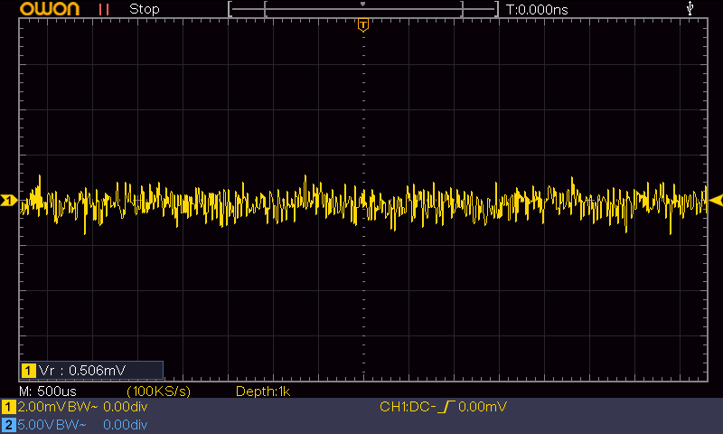
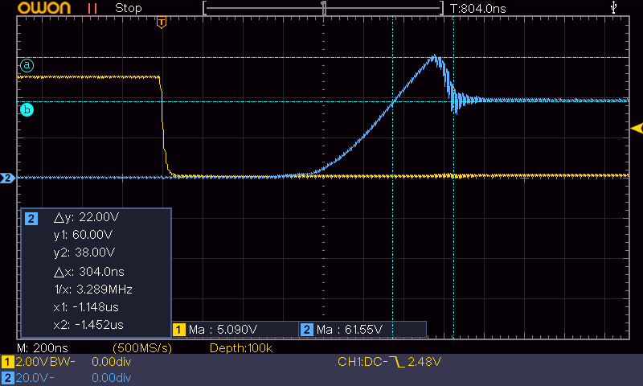
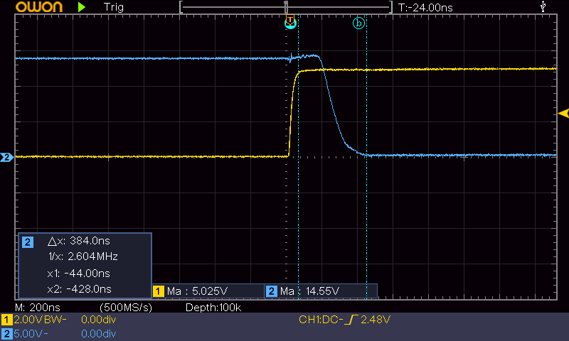

# Hardware Reference
--8<-- "status-reviewed.md"

A walkthrough of the Hüpftronik ECU's schematics and PCB design: the enclosure, thermal design, and the circuits behind every input and output.

!!! note "Design files"
    The board is currently in alpha testing (see the [product overview](24p_v1_overview.md)) and the
    schematic/PCB source files are not yet published. This page will link to the GitHub repository
    once the design is public.

---

## 1. Enclosure Options

### 1.1. Quick Selection Guide
| Case Choice | Cooling Performance | Effort to Build | Best For... |
| :--- | :--- | :--- | :--- |
| **AliExpress 24-Pin Aluminum** | **Excellent** | **Low** (Plug-and-play) | Standard builds, high-performance engines, and harsh environments. |
| **Custom / 3D-Printed** | **Poor** | **High** (Requires custom design) | Test benches or very tight spaces. |

### 1.2. Recommended: AliExpress 24-Pin Aluminum Enclosure
The PCB is designed around the standard 24-pin cast aluminum waterproof enclosure — the board's connector mates directly with the one supplied with these cases. The aluminum shell does two jobs:

* **Heat sinking:** pulls heat away from the power components.
* **Electrical shielding:** blocks engine-bay electrical noise from reaching the electronics.

!!! tip "Sourcing"
    Search AliExpress or a similar marketplace for "24 pin waterproof aluminum ECU case" — several
    sellers offer this connector/enclosure combination. We don't yet have a vetted single source to
    link to directly; verify the connector pinout matches an FCI 24-pin sealed automotive connector
    (3×8 grid) before buying.

### 1.3. Custom / DIY Solutions
A custom housing works, but you must handle two things yourself:

1. **The connector:** source the 24-pin automotive header separately — it is not a standard part.

2. **The heat:** plastic (3D-printed) cases trap heat. If you use plastic, you **must** add a flat aluminum base plate and couple the PCB to it with a thermal pad.

---

## 2. Keeping it Cool (Thermal Management)

The injector drivers generate heat, and if they get too hot they fail. With the aluminum enclosure, place a **Thermal Interface Material (TIM) pad** between the bottom of the PCB and the case floor — it gives the heat a low-resistance path into the metal.

| Setup | Heat Level | Cooling Requirement |
| :--- | :--- | :--- |
| **2 Cylinders per Driver** (Standard) | Low | Standard PCB cooling is usually enough. A thermal pad is a good "extra" safety measure. |
| **4 Cylinders per Driver** (High Stress) | High | **Mandatory:** You must use a thermal pad to bridge the heat directly to the aluminum case. |

*(Math: **§A.1 Thermal Analysis** in the Technical Appendix.)*

---

## 3. Sensor Inputs (Analog Inputs)

Analog inputs read 0–5 V sensors (TPS, MAP, temperature). Engine bays are electrically noisy, so each signal is protected, filtered, and scaled before it reaches the processor.

### 3.1. Quick Specs
* **Input Voltage:** Accepts 0–5 V (scales it down to 0–3.24 V for the processor).
* **Filtering:** Removes high-frequency electrical noise.
* **Protection:** Includes a "TVS diode" to protect against static electricity (ESD).

### 3.2. How it Works
1. **Protection:** A TVS diode at the connector blocks ESD before it reaches anything else.
2. **Cleaning:** An RC filter smooths out high-frequency noise.
3. **Scaling:** A voltage divider drops the 0–5 V sensor range to the MCU's 3.3 V-safe input range.

*(Circuit details: **§A.3 Analog Input Topology**; why there's no op-amp buffer: **§A.3.1**.)*

### 3.3. Measured Noise at the MCU Pin

The capture below was taken at the MCU pin with a throttle-position sensor (TPS) / potentiometer as
the source — i.e. *after* the divider has scaled 0–5 V down to the 0–3.24 V input range
(active span $\approx 3.15\ \text{V}$).

| Scope Setting | Value |
| :--- | :--- |
| Horizontal | $2.0\ \text{µs/div}$ (@ $1\ \text{GS/s}$) |
| Channel 1 | $200\ \text{µV/div}$, BW limited, DC coupled |
| Measured ripple-RMS ($V_\mathrm{r}$) | $506\ \text{µV}$ ($0.506\ \text{mV}$) |
| DC average | $0.00\ \text{mV}$ |

The residual noise is $\approx 506\ \text{µV}$ RMS of random broadband noise — no coherent
interference. Against the active span, that is an SNR of roughly $76\ \text{dB}$:

$$\text{SNR} = 20 \log_{10}\left(\frac{3.15\ \text{V}}{0.506\ \text{mV}}\right) \approx 75.9\ \text{dB}$$

On the MCU's 12-bit, $3.3\ \text{V}$ ADC ($0.806\ \text{mV/LSB}$), that noise is only about
$0.63\ \text{LSB}$ — normal oversampling or firmware filtering keeps the reading rock-stable.

!!! tip "What this means in practice"
    A TPS typically swings $\sim 0.5$–$4.5\ \text{V}$ at the connector ($\sim 0.32$–$2.92\ \text{V}$ at the MCU pin, a $\approx 2.6\ \text{V}$ span), so sub-millivolt noise is negligible. If you see much larger ripple in your own build, check sensor ground routing, the $+5\ \text{V}$ reference return path, and whether the input runs near injector or ignition wiring.

---

## 4. Outputs (Low-Side Drivers)

The ECU uses low-side driver MOSFETs as electronic switches for relays, solenoids, and injectors.

### 4.1. Why use discrete MOSFETs?
Other ECUs use "smart driver" ICs. This board uses discrete MOSFETs instead: they're cheaper, handle more current, and switch faster. Since the loads are known (relays and injectors), per-channel monitoring isn't worth the cost — a strong, fast switch is all that's needed. *(Full comparison: **§A.2**.)*

### 4.2. The "Translator" (Gate Drive)
The STM32 runs 3.3 V logic, but the MOSFETs switch harder and faster with 5 V on the gate. A **buffer chip (SN74ACT244PWR)** translates the 3.3 V signals into strong 5 V gate drive.

### 4.3. Safety & Protection

#### 4.3.1. Active Clamping (Injectors & Solenoids)
When an injector or solenoid coil turns off, its collapsing magnetic field generates a high-voltage inductive "kickback." The injector channels handle this with **active clamping** — a Zener feedback path from Drain to Gate:

*   **How it works:** Once the turn-off spike exceeds the Zener threshold, current feeds back into the Gate and turns the MOSFET slightly back on (into its linear region), dissipating the inductive energy safely in the silicon.

*   **Fast injector closing:** Clamping at a high voltage (settling to $\approx 40\ \text{V}$ on this board) forces the magnetic field to collapse quickly, giving fast, repeatable injector closing times.

*   **Thermal distribution:** The robust MOSFET die absorbs the energy spike instead of small discrete diodes on the board.

#### 4.3.2. The IAC Diode (Freewheeling)
The Idle Air Control (`IAC`) channel runs continuous high-frequency PWM — thousands of switch cycles per minute. Active clamping there would dump continuous thermal energy into the MOSFET and overheat it.

Instead, the `IAC` channel has a dedicated **freewheeling diode** to $+12\ \text{V}$: at turn-off, the inductive current recirculates through the diode at a low voltage drop ($\approx 0.7\ \text{V}$), keeping the MOSFET cool during sustained PWM.

#### 4.3.3. Clamp & Switching Verification
Both the active clamp and the turn-on performance have been verified on the oscilloscope.

##### A. Injector Turn-Off (Active Clamping Transition)

=== "Detailed Verification Capture"
    

    *High-detail single-channel capture: MOSFET Drain voltage ($V_{\mathrm{DS}}$, yellow trace) only.*
    During the Zener's brief turn-on delay, the Drain spikes to about $67\ \text{V}$ for
    $\approx 200\ \text{ns}$; then the feedback via the $36\ \text{V}$ Zener activates and the clamp
    settles to a stable $\approx 40\ \text{V}$ plateau, dissipating the coil energy in the MOSFET.

=== "Logic Signal Correlation"
    

    *Timing correlation: gate drive (CH1, yellow, 2.00 V/div) vs. Drain voltage ($V_{\mathrm{DS}}$, CH2, blue, 10.0 V/div) as the injector closes.*
    As soon as the gate drive goes low, conduction stops and the Drain pulls up to the
    $\approx 40\ \text{V}$ clamp level, holding there until the inductive field collapses and it
    settles back to the $+12$–$14\ \text{V}$ battery rail.

##### B. Injector Turn-On (Charging Transition)

*Opening transient: gate drive stepping 0 → 5 V (CH1, yellow, 2.00 V/div) and the Drain voltage ($V_{\mathrm{DS}}$, CH2, blue, 10.0 V/div) dropping from battery level to 0 V.*

The steep falling edge of the Drain voltage shows the IRLR2905 turning ON fast. Minimal time in the resistive linear region means negligible switching losses, no heat rise, and a consistent, linear injector dead-time.

??? tip "Why a 67 V spike is safe for the MOSFET"
    The $67\ \text{V}$ peak exceeds the IRLR2905's rated $V_{\mathrm{DSS}} = 55\ \text{V}$, but the
    device simply enters its rated **avalanche breakdown** region for the sub-microsecond transient.
    Modern power MOSFETs are fully avalanche-rated, and the energy transferred in this
    $200\ \text{ns}$ window is orders of magnitude below the ratings
    ($E_{\mathrm{AS}} = 210\ \text{mJ}$, $E_{\mathrm{AR}} = 11\ \text{mJ}$,
    $I_{\mathrm{AR}} = 25\ \text{A}$).

    ??? example "Show avalanche energy calculation"
        The exact avalanche energy is $E = \int V_{\mathrm{DS}}(t) I_{\mathrm{D}}(t)\,\mathrm{d}t$
        and requires the Drain-current waveform. A realistic upper bound uses the peak
        injector-bank current from §A.1.1 — $4.67\ \text{A}$ (four injectors in parallel at
        $14\ \text{V}$) — held at the full $67\ \text{V}$ peak for the entire $200\ \text{ns}$:

        $$E_{\mathrm{avalanche}} \leq V \cdot I \cdot t = 67\ \text{V} \cdot 4.67\ \text{A} \cdot 200\ \text{ns} \approx 0.063\ \text{mJ} = 6.3 \times 10^{-5}\ \text{J}$$

        So at most **about $0.06\ \text{mJ}$** is deposited during the Zener turn-on delay — and the
        real figure is lower, since both voltage and current fall during the transient. Even this
        conservative bound is far below the $210\ \text{mJ}$ single-pulse avalanche rating.

??? note "Scope capture walkthrough"
    *   **Trace roles:** In the dual-channel captures, blue is the Drain voltage ($V_{\mathrm{DS}}$)
        and yellow is the gate drive. In the single-channel clamping zoom, the Drain is the yellow
        trace (sole active channel).
    *   **Zener turn-on delay ($200\ \text{ns}$):** The time it takes for the feedback
        $36\ \text{V}$ Zener (in series with a 1N4148 blocking diode) to start conducting. During
        this delay the Drain briefly spikes to **$\approx 67\ \text{V}$**.
    *   **Clamping plateau:** Once the Zener conducts into the Gate, the clamp settles to a stable
        **$\approx 40\ \text{V}$** — above the $36\ \text{V}$ Zener rating because of the low gate
        resistor value plus the 1N4148 drop. The high clamp voltage minimizes injector closing time
        while dissipating the magnetic energy in the silicon.

---

### 4.4. Output Summary Table

All low-side channels are rated for automotive voltage levels. PCB heat dissipation — not the silicon — sets the practical continuous current limits.

| Channel | Controls | MOSFET Used | Datasheet Max ($I_D$ @ 25°C) | Board Design Limit |
| :--- | :--- | :--- | :--- | :--- |
| `INJ1` & `INJ2` | Fuel Injectors | `IRLR2905` (D-PAK) | `42 A` | **Heatsink-Dependent**   Recommended **`< 5 A`** peak |
| `IAC` | Idle Air Control (PWM) | `NCE6005AS` (SOIC-8) | `5 A` | **Heatsink-Dependent**   **`< 2.0 A`** peak |
| `BOOST` | Boost Solenoid | `NCE6005AS` (SOIC-8) | `5 A` | **Heatsink-Dependent**   **`< 2.0 A`** peak |
| `FAN_RELAY` | Cooling Fan Relay | `NCE6005AS` (SOIC-8) | `5 A` | **Heatsink-Dependent**   **`< 2.0 A`** peak |
| `FP_RELAY` | Fuel Pump Relay | `NCE6005AS` (SOIC-8) | `5 A` | **Heatsink-Dependent**   **`< 2.0 A`** peak |

<small>\* *The IRLR2905's silicon capability is high, but PCB thermal performance restricts actual continuous current. See the Technical Appendix (§A.1–A.2) for multi-injector bank limits.*</small>

<small>\* *The `NCE6005AS` channels derate harder in proportion: the SOIC-8 package has far less footprint and thermal mass than the D-PAK. No worked calculation is published for this package yet — treat `< 2.0 A` as the practical continuous limit and stay well below the 5 A datasheet maximum on the PCB.*</small>

---

## 5. Ignition Outputs

The two ignition outputs `IGN1` and `IGN2` are **logic-level trigger outputs, not power drivers**.
They command an external igniter (power stage) or a smart coil with a built-in igniter — never an
ignition coil primary directly.

### 5.1. Circuit

Each channel is an `NSG4437` driver stage with a $330\ \Omega$ series resistor, which limits current
into the igniter input and damps ringing so the trigger edge stays clean over a real-world harness
run.

| Specification | Value |
| :--- | :--- |
| Output type | $+5\ \text{V}$ logic-level trigger (push/pull) |
| Driver | `NSG4437` |
| Series resistance | $330\ \Omega$ per channel |
| Intended load | External igniter input or smart-coil trigger input |
| Channels | 2 (`IGN1`, `IGN2`) |

### 5.2. Design Rationale

Driving coil primaries inside the ECU means intense localized heat and severe flyback transients in
the enclosure. Pushing the high-current switching out to a rugged, cheap igniter in the engine bay
keeps the ECU's thermal and EMI environment clean — and if a coil shorts, the external igniter fails
instead of the ECU.

With two channels, a 4-cylinder engine runs **wasted spark**: `IGN1` fires the coil pair 360° apart
(e.g. 1+4), `IGN2` the other pair (2+3). Fully sequential ignition would need four channels and is
not available on this board.

---

## 6. Trigger Input (VR Interface)

Engine position comes in through a dedicated differential VR sensor interface built around the
`MAX9924` IC (pins `VR_POS`/`VR_NEG` — see the
[IO Overview](24p_v1_overview.md#3-io-overview)).

A VR (variable reluctance) sensor's output amplitude grows with engine speed — from well under a
volt at cranking to tens of volts at redline. The `MAX9924` handles this with:

*   **Differential input:** both sensor wires are measured against each other, not against ground,
    so noise induced equally on both wires (the dominant failure mode near ignition wiring) cancels
    out.
*   **Adaptive threshold:** the detection threshold tracks the signal amplitude, so the same wiring
    works from cranking speed to redline without adjustment.
*   **Zero-crossing detection:** the output edge lands on the true magnetic zero crossing, keeping
    the decoded tooth position stable regardless of signal amplitude.

The interface also accepts a conditioned $0$–$5\ \text{V}$ square-wave trigger on `VR_POS` for
non-VR sources — see the
[Volvo distributor-contact case](../../guides/setup/specific/volvo-b2xx.md#324-distributor-contacts)
for the required conditioning circuit.

For a Hall-effect **cam sync** sensor, use one of the general-purpose inputs `SPARE_IN1`/`SPARE_IN2`
(0–5 V digital) and assign it as the cam input in your firmware configuration.

---

## 7. Power Supply

The board takes automotive $12\ \text{V}$ power on two inputs (see the
[IO Overview](24p_v1_overview.md#3-io-overview)):

*   **`VIN_KL30`** — permanent battery feed. Keeps the MCU alive for functions that must survive
    ignition-off (e.g. closing the SD log file cleanly).
*   **`VIN_KL15`** — ignition-switched feed. Tells the ECU the key is on.

### 7.1. Input protection

Both inputs pass through a series Schottky diode (reverse-polarity protection) followed by a TVS
crowbar that clips short transient surges before they reach the voltage regulators — the standard
load-dump environment of an automotive supply is handled by design.

!!! warning "Long-term overvoltage"
    The TVS crowbar protects against *short* surges. Sustained overvoltage above $\sim 20\ \text{V}$
    (e.g. a 24 V jump start) overheats the TVS diode until it fails short. See the
    [product overview](24p_v1_overview.md#3-io-overview).

### 7.2. Internal rails

Behind the protection stage, onboard LDO regulators derive two logic rails:

| Rail | Used for | Exposed on |
| :--- | :--- | :--- |
| $+5\ \text{V}$ | Sensor reference, output buffer, RS232 header | Pin C5, header H3 |
| $+3.3\ \text{V}$ | MCU, logic | Header H2 (SWD) |

The $+5\ \text{V}$ rail on pin C5 is the **sensor reference** — power your TPS, MAP/T-MAP, and other
5 V sensors from it (never from switched +12 V through a divider) so sensor readings stay ratiometric
with the ADC reference.

!!! note "Sensor rail current budget: to be confirmed"
    The rated external load of the $+5\ \text{V}$ sensor rail has not been published yet. A typical
    passive-sensor set (TPS + T-MAP + CLT) draws only a few tens of mA and is well within any LDO's
    capability; for unusual loads (many active sensors, external modules), wait for the confirmed
    figure or measure your own draw.

---

## 8. Communications and Storage

### 8.1. CAN bus

One ISO 11898 CAN channel is exposed on pins A5/B5 (`CAN_H`/`CAN_L`). See
[CAN Bus Basics](../../guides/setup/canbus-basics.md) for wiring and termination rules.

!!! note "Onboard termination: to be confirmed"
    Whether the board fits an onboard $120\ \Omega$ terminator (and whether it is jumper-selectable)
    will be documented here once confirmed against the production board. Until then, verify your bus
    empirically: with everything powered off, measure across `CAN_H`/`CAN_L` — $\approx 60\ \Omega$
    means two terminators are present (correct), $\approx 120\ \Omega$ means only one, open means
    none.

### 8.2. SD card logging

The SD card slot is wired to the MCU's native SDIO interface (not SPI), which is fast enough for
high-rate logging. Use a Class 10 card. Logging behavior (file format, start/stop conditions) is a
firmware feature — rusEFI and Speeduino each document their own SD logging configuration. Logs are
analyzed on a PC with the same tools used for TunerStudio datalogs.

### 8.3. USB

The full-speed USB port serves three roles: the TunerStudio/console connection during setup and
tuning, firmware console access, and DFU firmware flashing (see
[Flashing the PCB](setup/flashing.md#2-usb-dfu-bootloader)).

---

## 9. Technical Appendix

Sections 1–8 cover what most builders need. This appendix holds the math and component-level detail
behind those numbers — read it to verify the thermal limits yourself, compare driver architectures,
or adapt the board for a load outside the summary table.

### 9.1. A.1. Thermal Analysis

A 4-injector single-driver setup raises the thermal load, but stays practical as long as heat is
moved into the enclosure. Without that path — bare-PCB junction-to-ambient resistance of
$R_{\theta JA} = 50\ \text{°C/W}$ per the IRLR2905 datasheet, no thermal pad — the junction
temperature rise would be:

$$\Delta T_{\mathrm{JA}} = 3.88\ \text{W} \cdot 50\ \text{°C/W} = 194\ \text{°C}$$

At a 50°C ambient, that's about **244°C** — far beyond survivable.

!!! success "Thermal coupling to enclosure"
    A thermal pad drops the effective thermal resistance from the bare-PCB $50\ \text{°C/W}$ above to
    roughly $8.36\ \text{°C/W}$ by giving the heat a low-resistance path into the aluminum case
    (see §A.2.1 for the resulting junction temperatures with this coupling in place).

#### 9.1.1. A.1.1. Loss Calculations

*   **Conduction Losses ($P_{\mathrm{cond}}$)**
    Parallel resistance for 4 injectors is $3\ \Omega$; Peak current at 14V is $4.67\ \text{A}$.
    
    $$P_{\mathrm{cond}} = I_{\mathrm{peak}}^2 \cdot R_{\mathrm{DS(on)}} \cdot D = (4.67\ \text{A})^2 \cdot 0.035\ \Omega \cdot 0.80 \approx 0.61\ \text{W}$$

*   **Inductive Losses ($P_{\mathrm{clamp}}$)**
    At 6000 RPM (100 Hz switching), the energy dumped into the Zener clamp is:
    
    $$P_{\mathrm{clamp}} = E_{\mathrm{clamp}} \cdot f = 0.0327\ \text{J} \cdot 100\ \text{Hz} \approx 3.27\ \text{W}$$

*   **Total Thermal Load**
    
    $$P_{\mathrm{total}} = 0.61\ \text{W} + 3.27\ \text{W} = 3.88\ \text{W}$$

---

### 9.2. A.2. Discrete MOSFET vs. Automotive Smart Driver

Swapping the low-$R_{\mathrm{DS(on)}}$ discrete MOSFET for an automotive smart low-side driver shifts the thermal profile and changes the failure mode.

#### 9.2.1. A.2.1. Thermal Comparison

The inductive energy from the injector coils must be dissipated either way, so the $3.27\ \text{W}$ clamp loss is fixed. Smart drivers typically have a higher $R_{\mathrm{DS(on)}}$ (e.g. $70\ \text{m}\Omega$), which doubles the conduction losses:

| Parameter | Discrete (IRLR2905) | Smart Driver (Typical) |
| :--- | :--- | :--- |
| $R_{\mathrm{DS(on)}}$ | $35\ \text{m}\Omega$ | $70\ \text{m}\Omega$ |
| Conduction Loss | $0.61\ \text{W}$ | $1.22\ \text{W}$ |
| Inductive Loss | $3.27\ \text{W}$ | $3.27\ \text{W}$ |
| Total Thermal Load | $3.88\ \text{W}$ | $4.49\ \text{W}$ |

With the §A.1 enclosure coupling ($8.36\ \text{°C/W}$, PCB-to-case via thermal pad) at $50\ \text{°C}$ ambient, the smart driver runs hotter: $87.5\ \text{°C}$ vs $82.4\ \text{°C}$.

#### 9.2.2. A.2.2. Architecture & Failure Modes

The discrete IRLR2905 and NCE6005 will continue operating under extreme thermal stress until destructive failure. 

Check operating conditions and heatsinking with this widget.

  <iframe src="../interactive_heat.html" title="Interactive thermal comparison" style="width: 100%; height: 650px; min-height: 650px; border: 0; display: block; margin: 0;"></iframe>

### 9.3. A.3. Analog Input Topology

ESD Protection
:   `USBLC6-2SC6` bidirectional TVS diode placed at the connector to prevent traces from acting as antennas for EMI.

RC Network
:   $R_{\mathrm{series}}$ ($1.8\ \text{k}\Omega$), $R_{\mathrm{shunt}}$ ($3.3\ \text{k}\Omega$), and $C_{\mathrm{shunt}}$ ($100\ \text{nF}$).

Corner Frequency
:   $f_c \approx 1.37\ \text{kHz}$

!!! info "Fault Tolerance"
    The TVS diode is designed to sacrifice itself if 12 V is accidentally applied to an input, maintaining signal purity for normal 0–5V operation.

!!! note "These values are for ratiometric channels (TPS, MAP/T-MAP)"
    The R/C values above suit fast, ratiometric sensors that need reasonable bandwidth. The
    thermistor-based `CLT`/`IAT` channels use a higher-impedance network with a larger capacitor —
    see **§A.3.2 Thermistor Channels (CLT/IAT)** for why.

!!! note "Why the divider sits close to the MCU"
    The placement of TVS, resistors, and capacitors matters as much as their values.
    
    **TVS at the connector:** The TVS diode is placed immediately at the connector because that's the entry point for ESD and EMI — it must clamp transients before they travel any further onto the board. Because it conducts only during transients and has essentially zero series impedance in the signal path when inactive, it doesn't interact with trace length.
    
    **Divider/filter near the MCU:** The series resistor $R_{\mathrm{series}}$, by contrast, is lossy at RF. A resistor in series with a long trace can act as part of an unintentional envelope detector: a long trace picks up RF energy (like a mini antenna), and the resistor combined with parasitic/shunt capacitance and the nonlinearities of nearby ESD/protection diodes can rectify and demodulate that RF into a baseband disturbance that shows up as noise or offset on the ADC reading. This is the classic "RF rectification at op-amp/ADC inputs" failure mode.
    
    **Physical placement strategy:** By keeping $R_{\mathrm{series}}$, $R_{\mathrm{shunt}}$, and $C_{\mathrm{shunt}}$ physically close to the MCU pin, the trace length after the divider/filter is minimized — i.e., the last passive components before the ADC input are close to the pin, so there is minimal trace to re-couple RF energy downstream of the filtering network. Any RF picked up on the long connector-to-MCU trace gets bled off by $C_{\mathrm{shunt}}$ right at the pin rather than being modulated by a resistor sitting far away. This is consistent with what §A.3.1 already says about $C_{\mathrm{shunt}}$ "sitting right at the pin as a local charge reservoir" — the same physical placement also serves this RF-immunity purpose, it is just not stated in those terms.

#### 9.3.1. A.3.1. Why Direct-to-MCU Instead of Op-Amp Buffering

Why feed the divider node straight into the MCU pin instead of adding a unity-gain op-amp buffer
(e.g. an `MCP6002`)? Because the divider's source impedance is already low enough for the ADC to
sample directly — a buffer would add cost, board space, and new failure modes without solving a
problem that exists here.

**1. The divider's Thevenin impedance is already low.**
What the ADC's sample-and-hold capacitor sees is the impedance looking back into the node between
$R_{\mathrm{series}}$ and $R_{\mathrm{shunt}}$, with the source at AC ground:

$$R_{\mathrm{source}} = R_{\mathrm{series}} \parallel R_{\mathrm{shunt}} = \frac{1.8\ \text{k}\Omega \cdot 3.3\ \text{k}\Omega}{1.8\ \text{k}\Omega + 3.3\ \text{k}\Omega} \approx 1.16\ \text{k}\Omega$$

That's comfortably under what STM32-class ADCs need to charge their sampling capacitor within one
acquisition phase — see **§A.3.3** for the worked limit on this board's `STM32F405`.
$C_{\mathrm{shunt}}$ helps too: it sits right at the pin as a local charge reservoir, supplying the
brief burst the sampling capacitor demands.

**2. The divider is doing double duty.**
A unity-gain buffer isolates impedance but does not scale voltage. The 5 V→3.3 V scaling still needs
a resistor network somewhere — before or after the buffer — so buffering adds an active stage on top
of the divider rather than replacing it.

**3. What a buffer would actually change.**

| Aspect | Passive divider + RC (used here) | Buffered (e.g. `MCP6002` follower) |
| :--- | :--- | :--- |
| Output impedance at MCU pin | $\approx 1.16\ \text{k}\Omega$ (Thevenin) | $\approx 0\ \Omega$ (op-amp output) |
| Extra supply rail needed | No | Yes — clean rail-to-rail supply per chip |
| Parts per channel | 2 resistors + 1 cap | Same, plus one op-amp channel (2 channels/`MCP6002`) |
| Tolerant of long/high-Z sensor wiring | Only if source impedance stays low | Yes — buffer absorbs it |
| Immune to ADC-mux charge-injection kickback | Only as good as $C_{\mathrm{shunt}}$ + source impedance | Yes — low-Z output soaks up the transient instantly |
| New failure modes | None beyond the existing TVS/passive network | Op-amp output can fail shorted to a rail; offset voltage error (a few mV); potential instability driving $C_{\mathrm{shunt}}$ directly without a series isolation resistor |
| Bill of materials / board space | Minimal | Higher — extra IC, decoupling, routing per channel |

**4. Why it doesn't matter here.**
The two scenarios where a buffer earns its keep — charge-injection kickback from fast channel
multiplexing, and high source impedance from long cable runs — aren't in play: this board's
ratiometric sensors (TPS, MAP/T-MAP) are low-kΩ sources read sequentially by a single-ended ADC. The
passive divider is therefore the simpler, cheaper, more reliable choice.

The thermistor channels (`CLT`, `IAT`) run a higher Thevenin impedance (§A.3.2), but firmware groups
them with TPS on the same lower-rate ADC conversion group (§A.3.3), which already gives them more
sample time than a buffer would ever be needed for.

!!! tip "When you *would* want a buffer"
    If you're adapting this front-end for a sensor with much higher source impedance (e.g. a
    thermistor with a large pull-up resistor), a long unshielded harness run, or a shared ADC channel
    multiplexed at high speed across many inputs, a unity-gain buffer ahead of the RC filter becomes
    worthwhile. In that case, keep a small series resistor ($10$–$100\ \Omega$) between the op-amp
    output and $C_{\mathrm{shunt}}$ to prevent the op-amp from seeing the capacitor as a direct load,
    which can cause peaking or oscillation.

#### 9.3.2. A.3.2. Thermistor Channels (CLT/IAT): Higher-Z, Heavier Filtering

Coolant (`CLT`) and Intake Air Temperature (`IAT`) use two-wire NTC thermistors — just a variable
resistance to ground, with no divider of their own. The board supplies the missing divider half and
filters the result much more aggressively than the TPS/MAP channels, since a temperature reading
never needs millisecond-scale response.

**Bias resistor (sensor excitation).**
A $2.7\ \text{k}\Omega$ pull-up to $+5\ \text{V}$ forms a divider with the external NTC: as the
thermistor's resistance falls with rising temperature, the node voltage falls with it. The value is
sized so the usable temperature range maps to a reasonable voltage swing.

**RC filter stage.**
From that raw node, the signal passes through a series/shunt network before reaching the MCU:

| Component | Role | Value |
| :--- | :--- | :--- |
| $R_{\mathrm{series}}$ | Series resistor into the filter node | $10\ \text{k}\Omega$ |
| $R_{\mathrm{shunt}}$ | Shunt resistor to GND | $18\ \text{k}\Omega$ |
| $C_{\mathrm{shunt}}$ | Shunt capacitor to GND | $1\ \mu\text{F}$ |

The resistors are $5$–$6\times$ larger than the TPS channel's and the capacitor $10\times$ larger.
Using the same Thevenin approach as §A.3.1:

$$R_{\mathrm{source}} = R_{\mathrm{series}} \parallel R_{\mathrm{shunt}} = \frac{10\ \text{k}\Omega \cdot 18\ \text{k}\Omega}{10\ \text{k}\Omega + 18\ \text{k}\Omega} \approx 6.43\ \text{k}\Omega$$

$$f_c = \frac{1}{2\pi \cdot R_{\mathrm{source}} \cdot C_{\mathrm{shunt}}} = \frac{1}{2\pi \cdot 6.43\ \text{k}\Omega \cdot 1\ \mu\text{F}} \approx 24.8\ \text{Hz}$$

That's roughly **55× lower** than the TPS channel's $1.37\ \text{kHz}$ corner frequency.

!!! success "Why heavier filtering makes sense here"
    Coolant and intake air temperature are governed by thermal mass — they can't change in less than
    seconds. Pushing the corner frequency far down costs nothing and rejects far more of the injector
    and ignition switching noise coupled onto these sensors' long engine-bay harness runs.

!!! note "Higher source impedance is still fine—the firmware already samples it slower"
    At $\approx 6.43\ \text{k}\Omega$, this channel's Thevenin impedance is higher than the TPS
    channel's $\approx 1.16\ \text{k}\Omega$ (§A.3.1) — but rusEFI-style firmware reads `CLT`, `IAT`,
    and `TPS` together on the same lower-rate ADC conversion group with a long sample time, so no
    buffer or special accommodation is needed. The numbers are worked out in **§A.3.3** below.

#### 9.3.3. A.3.3. ADC Settling Time Budget: Putting a Number on "Low Enough"

The "low enough" claims in §A.3.1 and §A.3.2 follow from the STM32's own ADC input model and the
sample time the firmware actually uses. This board's
[`STM32F405RGT6`](24p_v1_overview.md#3-io-overview) is an F4-family part, so ST's F4 ADC
characteristics apply.

**rusEFI's ADC conversion groups.**
rusEFI splits ADC channels into independent conversion groups, each with its own sample time. The
relevant one here is the **slow ADC group** (`stm32_adc_v2.cpp` on F4/F7, `stm32_adc_v4.cpp` on H7),
which handles `CLT`, `IAT`, `TPS`, battery voltage, and similar sensors at roughly $500\ \text{Hz}$
with a deliberately long sample time — `ADC_SAMPLE_56` (56 ADC clock cycles) on F4/F7, or
`ADC_SMPR_SMP_16P5` on H7. `TPS` is **not** in the faster group, so both the ratiometric (§A.3.1)
and thermistor (§A.3.2) channels get the generous budget below.

**The ADC input model.**
Internally, every STM32 ADC channel looks like a resistor $R_{\mathrm{ADC}}$ (the sampling switch) in
series with a capacitor $C_{\mathrm{ADC}}$ (the sample-and-hold cap). For STM32F4 parts, ST's
datasheet gives approximately:

$$R_{\mathrm{ADC}} \approx 6\ \text{k}\Omega, \qquad C_{\mathrm{ADC}} \approx 12\ \text{pF}$$

During sampling, the source ($R_{\mathrm{source}}$, the Thevenin impedance from §A.3.1/§A.3.2) must
charge $C_{\mathrm{ADC}}$ through both resistances in series:

$$\tau = (R_{\mathrm{source}} + R_{\mathrm{ADC}}) \cdot C_{\mathrm{ADC}}$$

**How long is available to settle.**
At `ADC_SAMPLE_56` with the F4's ADC clock at $21\ \text{MHz}$, the sampling phase lasts:

$$t_{\mathrm{sample}} = \frac{56}{21\ \text{MHz}} \approx 2.67\ \mu\text{s}$$

Settling a 12-bit conversion to within 1 LSB ($1/4096 \approx 0.0244\%$ of full scale) takes roughly
$n = 7$ to $9$ time constants ($e^{-9} \approx 1/8100$, comfortably past the 1-LSB target):

$$\tau_{\mathrm{max}} = \frac{t_{\mathrm{sample}}}{n} \approx \frac{2.67\ \mu\text{s}}{7\ \text{to}\ 9} \approx 296\ \text{to}\ 381\ \text{ns}$$

Solving for the maximum tolerable source impedance:

$$R_{\mathrm{source}} \leq \frac{\tau_{\mathrm{max}}}{C_{\mathrm{ADC}}} - R_{\mathrm{ADC}} \approx 18.7\ \text{to}\ 25.7\ \text{k}\Omega$$

**Applying it to this board's two channel types:**

| Channel | $R_{\mathrm{source}}$ (Thevenin) | vs. $18.7$–$25.7\ \text{k}\Omega$ ceiling |
| :--- | :--- | :--- |
| TPS / MAP (§A.3.1) | $\approx 1.16\ \text{k}\Omega$ | $\approx 16$–22× margin — comfortably clear |
| CLT / IAT (§A.3.2) | $\approx 6.43\ \text{k}\Omega$ | $\approx 3$–4× margin — comfortably clear |

!!! success "Both channel types settle with margin to spare"
    `TPS`, `CLT`, and `IAT` all share the same $\approx 500\ \text{Hz}$ slow ADC group and its
    56-cycle sample time, so even the thermistor channels' $6.43\ \text{k}\Omega$ source impedance
    settles with $3$–$4\times$ margin. The 28-cycle fast group (`ADC_SAMPLE_28`,
    $\approx 1.33\ \mu\text{s}$) exists for channels needing much higher conversion rates — none of
    the inputs described here are on it, so its tighter budget doesn't apply.

**A note on the external capacitors.**
A common guideline for a bare capacitor placed directly at an ADC pin (no series resistor) is
$100\ \text{pF}$ to $1\ \text{nF}$. $C_{28}$ ($100\ \text{nF}$) and $C_{32}$ ($1\ \mu\text{F}$) are
far larger — intentionally: they sit behind a defined series resistor as part of a purpose-built
anti-alias filter with a calculated corner frequency ($1.37\ \text{kHz}$ for TPS/MAP,
$24.8\ \text{Hz}$ for CLT/IAT). That's a different design goal than the generic "small cap at the
pin" rule, and it works because channels are read sequentially rather than multiplexed at high
speed — which is where a large cap plus high source impedance would cause channel-to-channel
crosstalk.

---

### 9.4. A.4. Output Characteristics

All channels are driven by the `SN74ACT244PWR` buffer (rail-to-rail `5 V`, `24 mA` source/sink).

| Specification | NCE6005AS (Relays/Solenoids) | IRLR2905 (Injectors) |
| :--- | :--- | :--- |
| **Gate Resistor** | `1 kΩ` | `220 Ω` *(chosen to maximize switching speed)* |
| **Rise Time (10–90%)** | `~2.15 µs` | `~756 ns` |
| **EMI Corner Frequency ($f_c$)**  <small>Transition to $-40\text{ dB/dec}$ roll-off</small> | `~148 kHz`  <small>$f_c = \frac{1}{\pi \cdot t_r}$</small> | `~421 kHz`  <small>$f_c = \frac{1}{\pi \cdot t_r}$</small> |
| **Design Goal** | Conservative current draw; speed is not critical for slower inductive loads. | Optimized to **minimize switching losses** (reducing time spent in the linear region) and minimize injector dead-time. |
